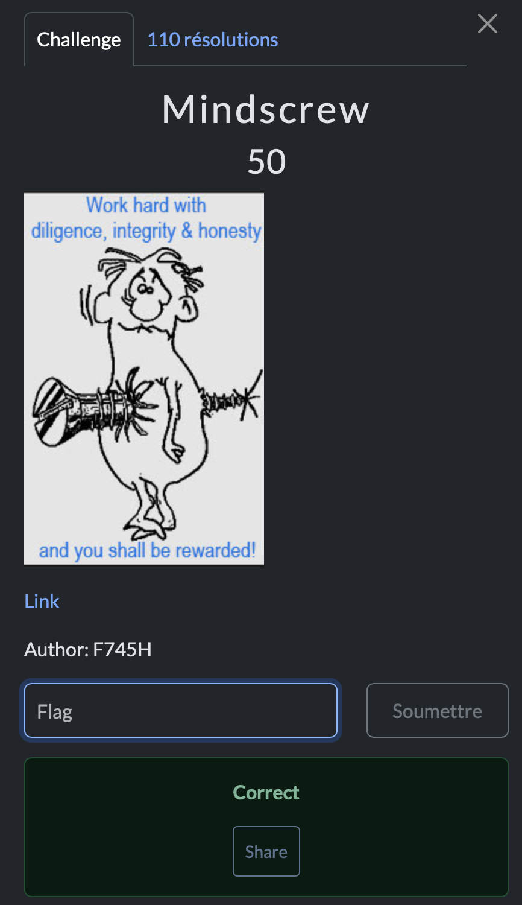

# Mindscrew

> Level: xxx || 50 points


## 1. Data

> Instruction



> Resource

A picture (See Resource folder)


## 2. Solution

**Step 1: Analyze the image**<br>

As always, I start with the basics. I ran the `string` command on the image to try and find some hidden characters. Surprise! Among the printable characters, a strange code caught my eye.


Then I come across a string that looks a lot like **`Brainfuck`**. For those who don't know, it's a minimalist programming language... really minimalist <3. I found out about it through a challenge on [Root-me](https://www.root-me.org) and [DECIPHER](https://deciphersxyz.wordpress.com/) : is a free online platform featuring an extensive list of cipher symbols.


**Step 2: Decode the Brainfuck**<br>

Don't panic, I've copied the Brainfuck code I found and decoded it. To do this, I used the [dcode](https://www.dcode.fr/brainfuck-language) tool, a handy online decoder. Simply paste in the Brainfuck code and the result is displayed.


## 3. Flag

```text
ThunderCipher{Br4inF*ck_i5_Scr3w3d!}
```
