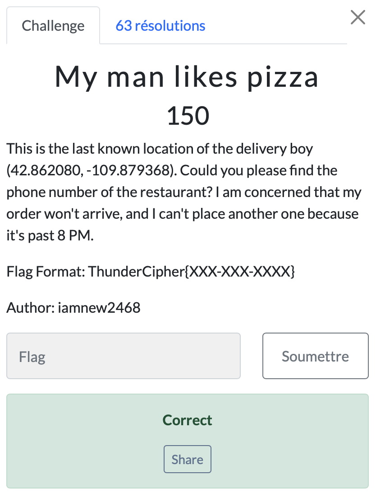

# My man likes pizza

> Level: xxx || 150 points

## 1. Data

> Instruction




## 2. Solution


To solve this OSINT problem using location coordinates, we used a [Google Maps route planner](https://www.coordonnees-gps.fr/itineraire) website to find the location relative to its coordinates. On this website, you simply enter the coordinates provided in the statement and you get an address “Rendezvous Meadows Golf Course, Club House Road, Pinedale, WY 82941, États-Unis d'Amérique”, which doesn't refer to a restaurant but rather to a golf center. Zooming in on the map, we see a pizzeria called **Old Stones Smokehouse and Country Pizza, 4 Country Club Lane, Pinedale, WY 82941, United States of America**.


We did a Google search and got the number of the pizzeria.


## 3. Flag

```text
ThunderCipher{307-367-6760}
```
