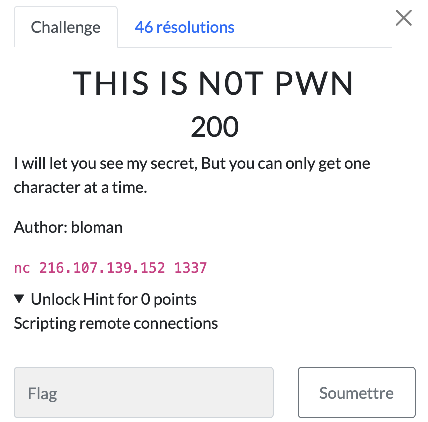

# This is not pwn

> Level: xxx || 200 points

## 1. Data

> Instruction




## 2. Solution

Honestly, I found this challenge very easy :). At first glance, I thought it would be a complicated challenge because of the *200 reward points*, but when I ran the netcat listener, I laughed.
<br>
On the first run, I get this output so I understand that each number represents a letter. At number 10, I see that the characters represented by each number give the flag format.

So, to go fast, I wrote a python script that I updated enough to work well.


```python
import subprocess

def communicate_with_server():

    # Run nc command with host and port
    process = subprocess.Popen(
        ["nc", "216.107.139.152", "1337"],
        stdin = subprocess.PIPE,
        stdout = subprocess.PIPE, 
        universal_newlines = True
    )
    
    # Send number to server
    for number in range(104):
        process.stdin.write(str(number) + '\n')
        process.stdin.flush()  # Make sure data is sent
        
        # Read and return the server response
        response = process.stdout.readline().strip()
        print("".join(response[-1]), end = '')
    
    process.terminate()

if __name__ == "__main__":
    communicate_with_server()
```

NB: The `subprocess` module allows you to spawn new processes, connect to their input/output/error pipes, and obtain their return codes.


## 3. Flag

```text
ThunderCipher{Y0U_n3eD_t0_L34rn_5cr1p7ing_B3c0z_tH15_1s_4_r3aLly_l0nG_fL4g_oR_els3_iT_t0oK_qU1t3_l0ng!!}
```
