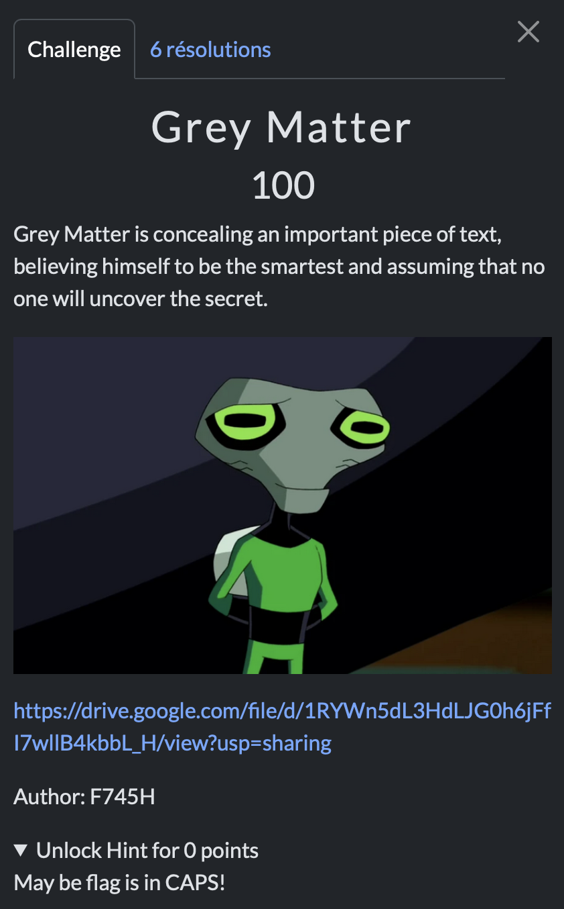

# Grey Matter

> Level: xxx || 100 points


## 1. Data

> Instruction



> Resource

A text file (See Resource folder)


## 2. Solution


A simple challenge, first to look at the text file, it's a file that contains a lot of text. We know the challenge is about Stegano, so we can use `grep` to find the flag.
But there's a hint in the challenge, which is the style of the flag (it must be in CAPS).


```bash
grep -o '[A-Z0-9{}_!]' Text.txt | tr -d '\n'
```

The command used allows us to :
- Find all the characters in the file Text.txt between A-Z, 0-9, {}, _ and ! with `'[A-Z0-9{}_!]'`.
- Delete the newline character `tr -d '\n'`.


## 3. Flag

```text
THUNDERCIPHER{N0_0N3_W1LL_F1ND_M3!!!}
```
