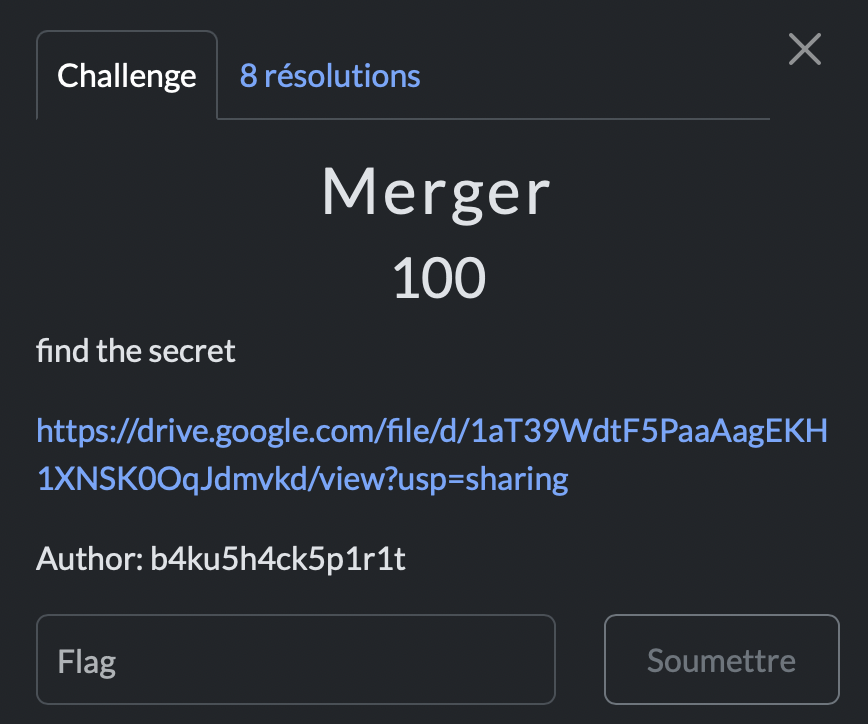

# Merger

> Level: xxx || 100 points


## 1. Data

> Instruction



> Resource

A zipped folder (available in the *Resource* folder)


## 2. Solution

To start, the zipped folder is uncompressed to reveal its contents. Inside, we find 11 images in a folder named **Note**. Each image appears to contain hidden information, likely embedded within their metadata. Using the tool `exiftool`, we examine the properties of these images. The command used is straightforward:  

```bash
exiftool Note/*.jpg
```

From the metadata, a particular property, Camera Model Name, stands out. Each image has a unique value for this property, suggesting it holds significant information. Given the challenge's title, Merger, it becomes apparent that these values must be concatenated to form a coherent string.

Upon merging the values from all the images, we obtain a string that is encoded in Base64. Recognizing this encoding pattern, which is common in CTF challenges, we proceed to decode it using the base64 tool:


The decoded output reveals the flag

## 3. Flag

```text
ThunderCipher{m3t4_d4t4_1s_fuN!!}
```
