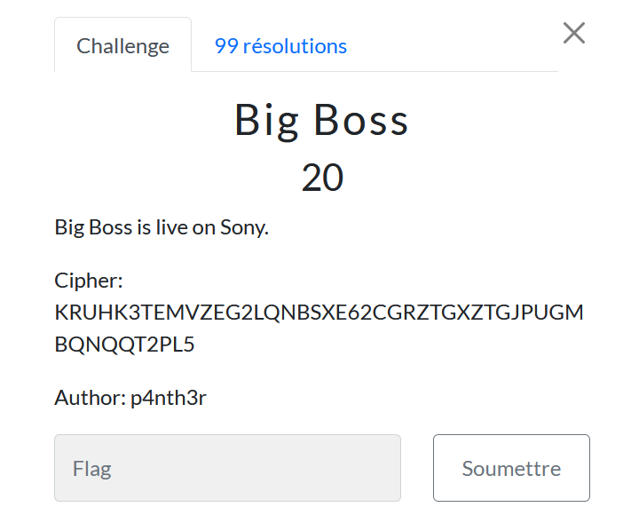

# Big boss

> Level: xxx || 20 points

## 1. Data

> Instruction



## 2. Solution

Use [Cyberchef](https://cyberchef.org/#recipe=From_Base32('A-Z2-7%3D',true)&input=S1JVSEszVEVNVlpFRzJMUU5CU1hFNjJDR1JaVEdYWlRHSlBVR01CUU5RUVQyUEw1) to solve this challenge by choosing the `From Base32` operator.


## 3. Flag
    
```
ThunderCipher{B4s3_32_C00l!==}
```

