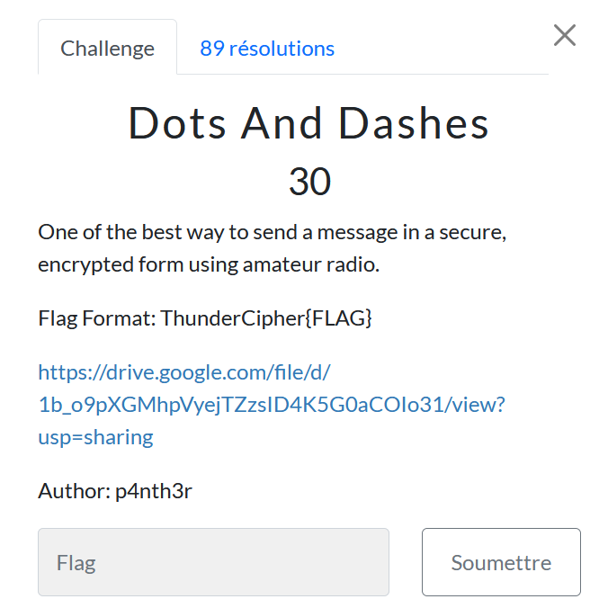

# Dots And Dashes

> Level: xxx || 30 points

## 1. Data

> Instruction



> Resource

A [.txt file](https://drive.google.com/file/d/1b_o9pXGMhpVyejTZzsID4K5G0aCOIo31/view?usp=sharing) available via a Drive link

## 2. Solution

Use [Cyberchef](https://cyberchef.org/#recipe=From_Morse_Code('Space','Line%20feed')&input=LS0gLS0tLS0gLi0uIC4uLiAuLi4tLSAuLi0tLi0gLi0tLS0gLi4uIC4uLS0uLSAtIC4uLi4gLi4uLS0gLi4tLS4tIC0uLi4gLi4uLS0gLi4uIC0gLi4tLS4tIC4uLS4gLS0tLS0gLi0uIC4uLS0uLSAuLi4gLi4uLS0gLS4gLS4uIC4tLS0tIC0uIC0tLiAuLi0tLi0gLS0gLi4uLS0gLi4uIC4uLiAuLi4uLSAtLS4gLi4uLS0) to solve this challenge by choosing the `From Morse Code` operator.


## 3. Flag
    
```text
ThunderCipher{M0RS3_1S_TH3_B3ST_F0R_S3ND1NG_M3SS4G3}
```

