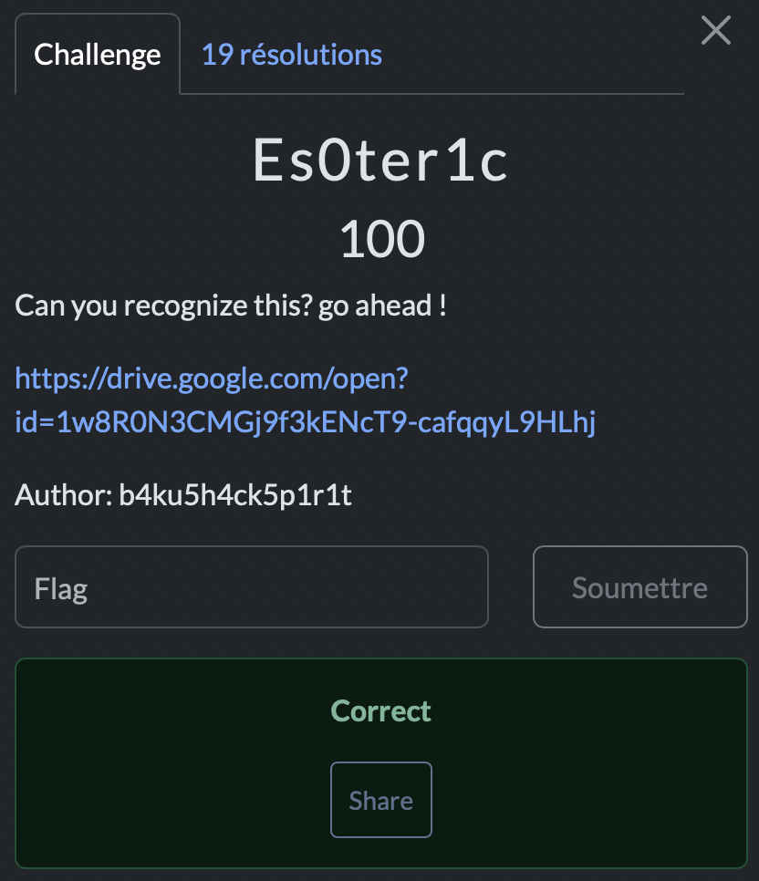

# Es0ter1c

> Level: xxx || 100 points

## 1. Data

> Instruction



> Resource

A file containing a long string of strange characters (See Resource folder)

## 2. Solution

My first clue was the title of the challenge, *Es0ter1c*. It seems to indicate that we're dealing with an esoteric programming language. Well-known languages include **`Brainfuck`**, **`Whitespace`**, **`Piet`** and... **`Malbolge`**!

The characters in the string quickly made me think of **Malbolge**, one of the most twisted languages in existence lol. It's an extremely complex language, designed to be almost impossible to program.

Since programming in Malbolge is almost mission impossible, I used an online interpreter to decode the string. There are several online tools, such as the one available at [tio.run](https://tio.run/#malbolge).

Executing the code in the interpreter, I quickly obtained an output that matched the flag.


## 3. Flag

```text
ThunderCipher{Y0u_r1C0rgn1z3d_Malb0lge_Language_N1c3!!!}
```
