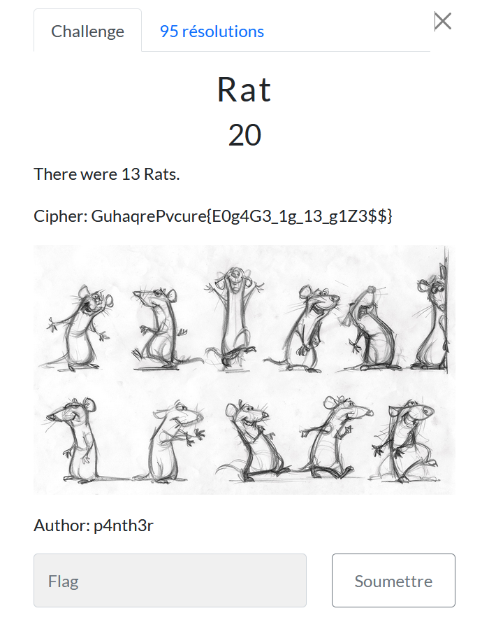

# Rat

> Level: xxx || 20 points

## 1. Data

> Instruction



## 2. Solution

Use [Cyberchef](https://cyberchef.org/#recipe=ROT13(true,true,false,13)&input=R3VoYXFyZVB2Y3VyZXtFMGc0RzNfMWdfMTNfZzFaMyQkfQ) to solve this challenge by choosing the `ROT13` operator.


## 3. Flag
    
```text
ThunderCipher{R0t4T3_1t_13_t1M3$$}
```

