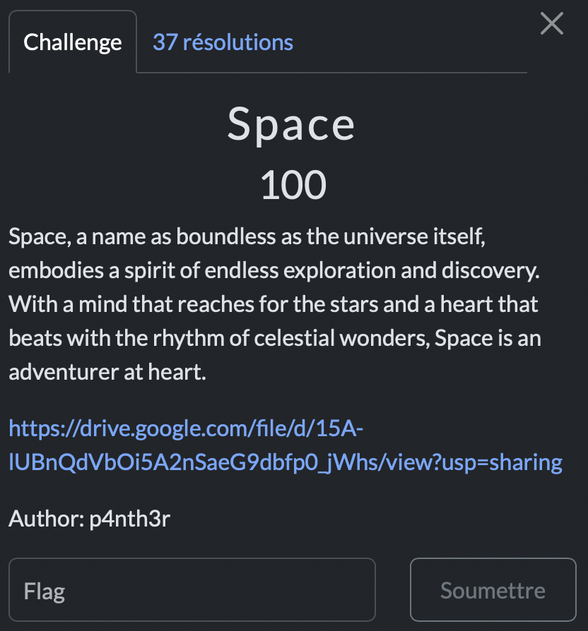

# Space

> Level: xxx || 100 points


## 1. Data

> Instruction



> Resource

A picture containing a string of strange characters (See Resource folder)


## 2. Solution

As with any challenge of this kind, I don't stress, I refer to my favorite site [DECIPHER](https://decipher.neocities.org/symbols), the best for deciphering all the symbols. After some searches on the website I found that it seems to be 'dream-smp' cipher. It's a alien language so I then matched the characters of the Dream SMP alphabet with the given characters to obtain the flag.<br><br>


<br>
## 3. Flag

```text
ThunderCipher{DOYOUUNDERSTANDALIENLANGUAGE}
```
