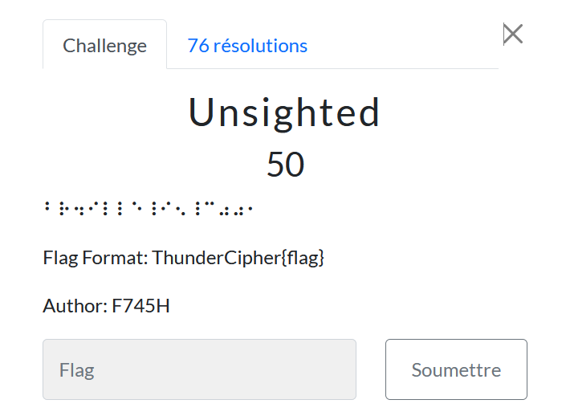

# Unsighted

> Level: xxx || 50 points

## 1. Data

> Instruction




## 2. Solution

The challenge is to decode the Braille code. It 's a tactile writing system with raised dots, for use by blind or severely visually impaired people.
Use [dcode](https://www.dcode.fr/alphabet-braille) to solve this challenge.


## 3. Flag
    
```text
ThunderCipher{BR4ILLE_I5_C001}
```

