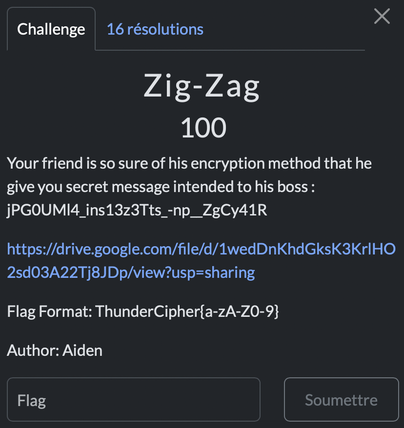

# Zig-Zag

> Level: xxx || 100 points


## 1. Data

> Instruction




## 2. Solution

For this crypto challenge, the title directly gave me a possibility with **Rail fence** cipher, also known as Zig-Zag.
It's a classical type of transposition cipher. [The Rail fence cipher](https://en.wikipedia.org/wiki/Rail_fence_cipher) derives its name from the manner in which encryption is performed, in analogy to a fence built with horizontal rails.

The number of keys must be increased to 6 to obtain the flag.<br>
**Used tool** : [dcode](https://www.dcode.fr/rail-fence-cipher)


## 3. Flag

```text
ThunderCipher{jUst_4_s1MPl3_Z1g-z4G_3nCRypTi0n}
```
