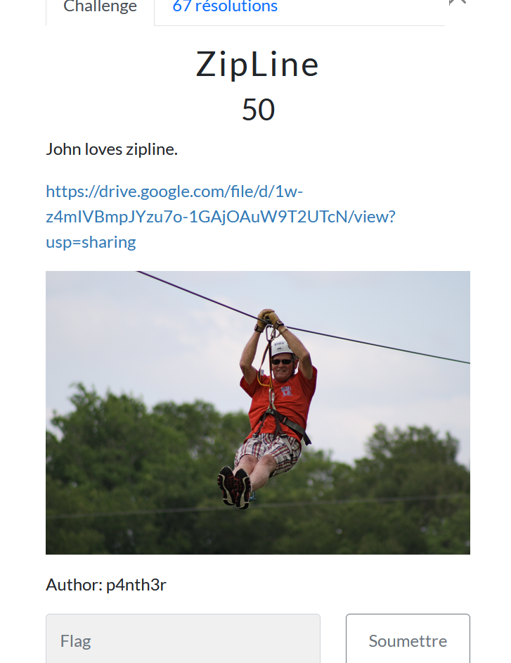

# Zipline

> Level: xxx || 50 points

## 1. Data

> Instruction



> Resource

A zipped folder `zipline.zip` (See Resource folder)


## 2. Solution

For this challenge, we've got a zipped folder, and we're working as usual with our favorite tools.

Ok, so we start by trying to unzip our folder with the `unzip` command, but it requires a password.


We're going to use the best tool for cracking passwords: **JohnTheRipper** with its zip2john command to generate a hash of the zip file.


We'll then use the `john` command to decrypt the password. The password found is *zigzag*, which we enter to unzip the folder and obtain the flag.


## 3. Flag

```text
ThunderCipher{P4ssW0rd_Pr0t3Ct3D_z1PPP$$$$}
```
