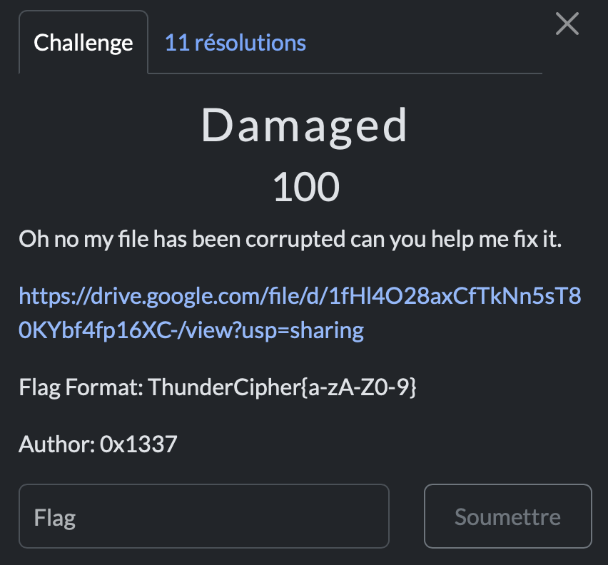

# Damaged

> Level: xxx || 100 points

## 1. Data

> Instruction



> Resource

A data file (See Resource folder)


## 2. Solution

A very basic challenge to repair a corrupted file. First, no extension for this file, so I start with a good old command `file` to see what it's all about. Result: “data”. Super vague... but that doesn't stop us!


I decide to take a look at the content with `cat` command. And there, jackpot! I recognize something familiar: *IHDR*. Ok, we have a PNG here. 


Let's then use a hexadecimal editor to see the first bytes of the file.

```bash
$ hexeditor damaged
```
A valid PNG file must start with the following signature:

```mathematica
89 50 4E 47 0D 0A 1A 0A
```
However, the first bytes of the file were corrupted and did not match this signature.


Once the first 8 bytes were corrected with the correct signature of the PNG format, I saved the file. Bingo! The image is displayed with the flag clearly visible.


## 3. Flag

```text
ThunderCipher{fixing_images_is_fun}
```
