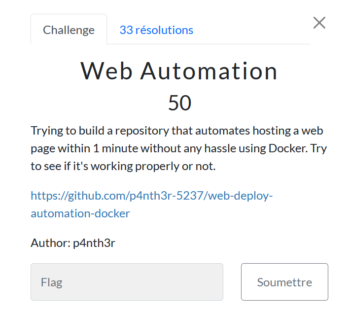

# Web automation

> Level: xxx || 50 points

## 1. Data

> Instruction



> Resource

https://github.com/p4nth3r-5237/web-deploy-automation-docker


## 2. Solution

Clicking on the link in the challenge statement takes you to a Github repo with **11 commits** on a single branch called main.


One thing I took as a clue was the contents of the Readme.md file, which says *Commitment*, so I started analyzing the commits made on the repo. 


Scanning the *adding Dockerfile to host in a container* commit, there's a line containing a string that appears to be encoded.

```text
VGh1bmRlckNpcGhlcntTM2NyM1RfMU5fRzF0X0MwbU1pdCE9PT19
```


To decode it, I used the [CyberChef](https://gchq.github.io/CyberChef/#recipe=Magic(3,false,false,'')&input=VkdoMWJtUmxja05wY0dobGNudFRNMk55TTFSZk1VNWZSekYwWDBNd2JVMXBkQ0U5UFQxOQ&oeol=CR) site using the *Magic* operation to determine the encoding type, I got the flag which was Base64 encoded.


## 3. Flag

```text
ThunderCipher{S3cr3T_1N_G1t_C0mMit!===}
```
