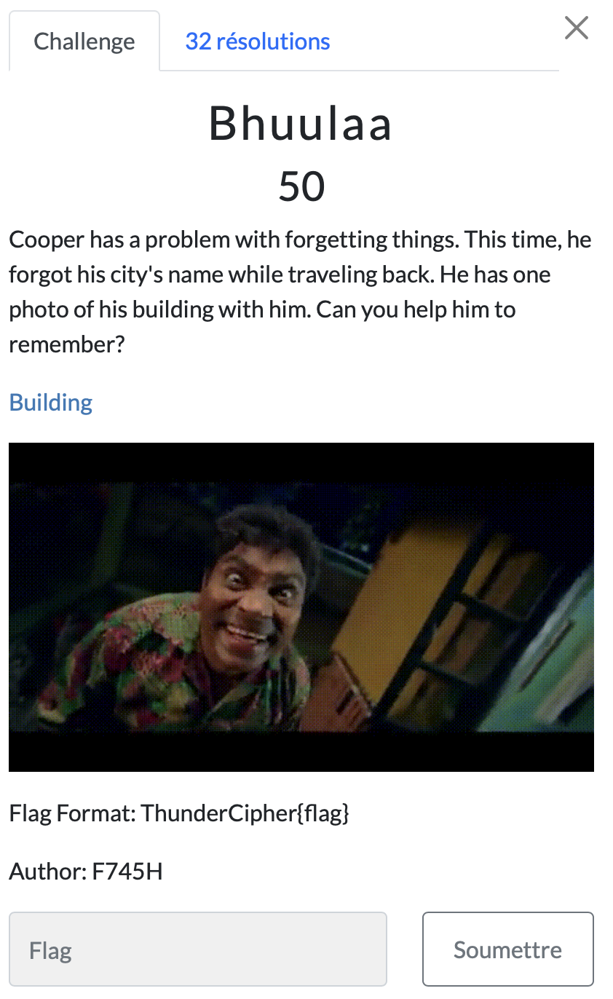

# Bhuulaa

> Level: xxx || 50 points

## 1. Data

> Instruction



> Resource

A `Home.jpg` picture

## 2. Solution

The photo shows a building. So what could be better than using [Google Lens](https://lens.google.com/) to identify the location? So we upload the photo and get the following result:


Analyzing each result, we come across a real estate sales site [www.fastinn.is](https://fastinn.is/soluskra/787711?assetId=787711#images) which shows the rooms in the apartment. We can see that the location is *Grandavegur 47, 107 Reykjavík, Iceland*. We deduce that the name of the city is Reykjavik, capital of Iceland.


## 3. Flag

```text
ThunderCipher{Reykjavik}
```
