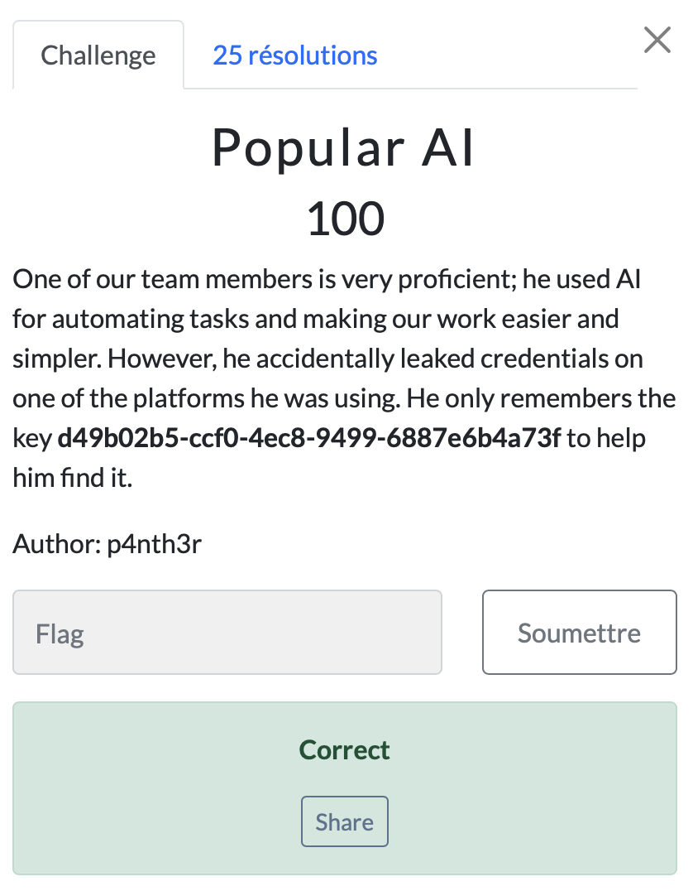

# Popular AI

> Level: xxx || 100 points

## 1. Data

> Instruction




## 2. Solution

For this challenge, we had to identify the AI tool most commonly used in these times. To do this, we have a string that represents the discussion key: 

```text
d49b02b5-ccf0-4ec8-9499-6887e6b4a73f
```

Automatically, we have to think of ChatGPT, which is the popular AI used by everyone.
And link sharing always takes this form:
```text
https://chatgpt.com/share/{key_value}
```

So if we use this key with the default sharing link format, we get a discussion with the flag.

```text
https://chatgpt.com/share/d49b02b5-ccf0-4ec8-9499-6887e6b4a73f
```


## 3. Flag

```text
ThunderCipher{P0PuL4r_A1_A$$1SST4NT_0P3N_4I!!}
```
