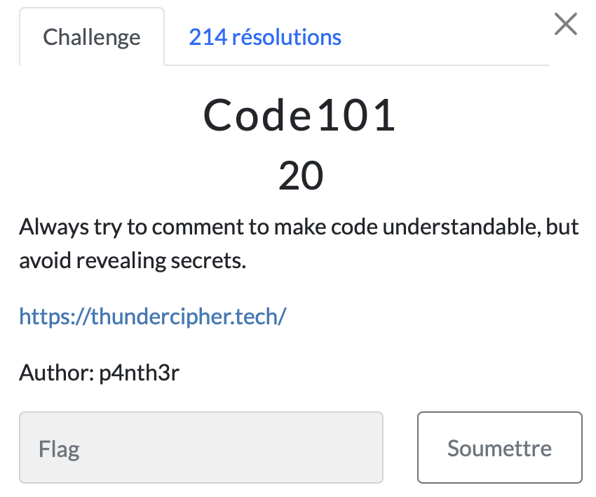

# Code 101

> Level: xxx || 20 points

## 1. Data

> Instruction




## 2. Solution

In the challenge, we were asked to read the comments on the challenge URL, so a Ctrl + U (on Windows) and to avoid reading anything other than the lines of code on the site, we did a little search with *`Cipher{`* and got the flag.


## 3. Flag

```text
ThunderCipher{S0urC3_C0d3_L3aK$}
```
