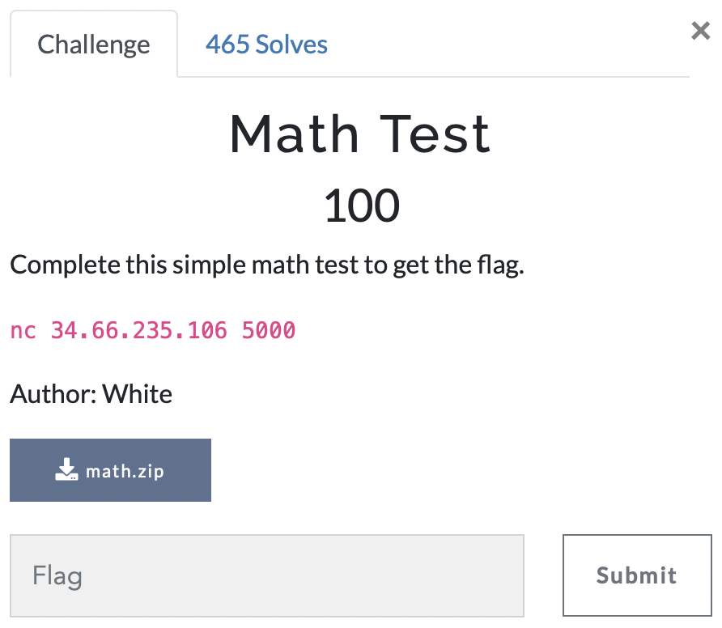

# Math Test

> Level: xxx || 100 points

## 1. Data

> Instruction




## 2. Solution

The challenge takes the form of a mathematical test, with the aim of solving 1,000 mathematical operations to obtain the flag.
```bash
Welcome to a simple math test.
If you solve these basic math questions, I will give you the flag.
Good Luck
Question: -803 // 352
Answer:
Correct 1/1000
Question: -630 * 391
Answer:
```

For greater speed and accuracy, we've developed a Python script to solve the questions automatically.

```python
import socket, re

# Connexion au serveur
with socket.socket(socket.AF_INET, socket.SOCK_STREAM) as s:
    s.connect(("34.66.235.106", 5000))

    # Reception du message d'introduction
    while True:

        data = s.recv(1024).decode().strip()
        print(data)

        # Si aucune donnée n'est reçue, on sort de la boucle
        if not data:
            break

        # with open("messages_reçus.txt", "a", encoding="utf-8") as file:
        #     file.write(data + "\n")
        # print("Message reçu et enregistré ")

        # Rechercher une question dans le message
        if "Question:" in data:

            # Extraire l'expression à calculer après "Question:"
            expression = data.split("Question: ")[-1].strip()
            # print(f"Expression extraite: {expression}")

            # Filtrer toute partie non mathématique (comme "Answer:")
            expression = re.sub(r'[^-+*/\d(). ]', '', expression)  # Garder que les chiffres et opérateurs

            # Calculer l'expression
            reponse = str(eval(expression))
            print(reponse)

            # Envoyer la réponse
            s.sendall(f"{reponse}\n".encode())

```

## 3. Flag
    
```text
uoftctf{7h15_15_b451c_10_7357_d16u153d_45_4_m47h_7357}
```

